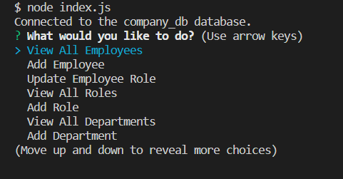

# SQL-Employee-Tracker

  ## Description

  This is a Node.js command-line application to manage a company's employee database, using [Inquirer](https://www.npmjs.com/package/inquirer/v/8.2.4), and [MySQL](https://www.npmjs.com/package/mysql2). With this application, you can view and manage the departments, roles, and employees in your company to organize and plan your business.

  ## Table of Contents
  
  - [Usage](#usage)
  - [Video](#video)
  - [Technologies](#technologies)
  - [Installation](#installation)
  - [License](#license)
  - [Questions](#questions)

  ## Usage

  Invoke the application by using the following command:
  ```bash
  node index.js
  ```
  * THEN you will be presented with the following options: view all departments, view all roles, view all employees, add a department, add a role, add an employee, and update an employee role.

  
  * WHEN you choose to view all departmentsm, THEN you are presented with a formatted table showing department names and department ids.
  * WHEN you choose to view all roles, THEN you are presented with the job title, role id, the department that role belongs to, and the salary for that role.
  * WHEN you choose to view all employees, THEN you are presented with a formatted table showing employee data, including employee ids, first names, last names, job titles, departments, salaries, and managers that the employees report to.
  * WHEN you choose to add a department, THEN you are prompted to enter the name of the department and that department is added to the database.
  * WHEN you choose to add a role, THEN you are prompted to enter the name, salary, and department for the role and that role is added to the database.
  * WHEN you choose to add an employee, THEN you are prompted to enter the employee’s first name, last name, role, and manager, and that employee is added to the database.
  * WHEN you choose to update an employee role, THEN you are prompted to select an employee to update and their new role and this information is updated in the database

  ## Video

  Please have a look at the walkthrough video demonstrating the functionality of this application:

  Video link: https://drive.google.com/file/d/1PAr1-BvWb3XDpvf_kE23sYixBxrN9PUk/view
  
  ## Technologies

  * [MySQL](https://www.npmjs.com/package/mysql2)
  * [Inquirer package](https://www.npmjs.com/package/inquirer/v/8.2.4)
  * [Console.table package](https://www.npmjs.com/package/console.table)

  ## Installation

  N/A

  ## License

  N/A

  ## Questions

  If you have additional questions, feel free to reach me through github or email.

  Github: https://github.com/xybai0103
  
  Email: xueyin0103@gmail.com